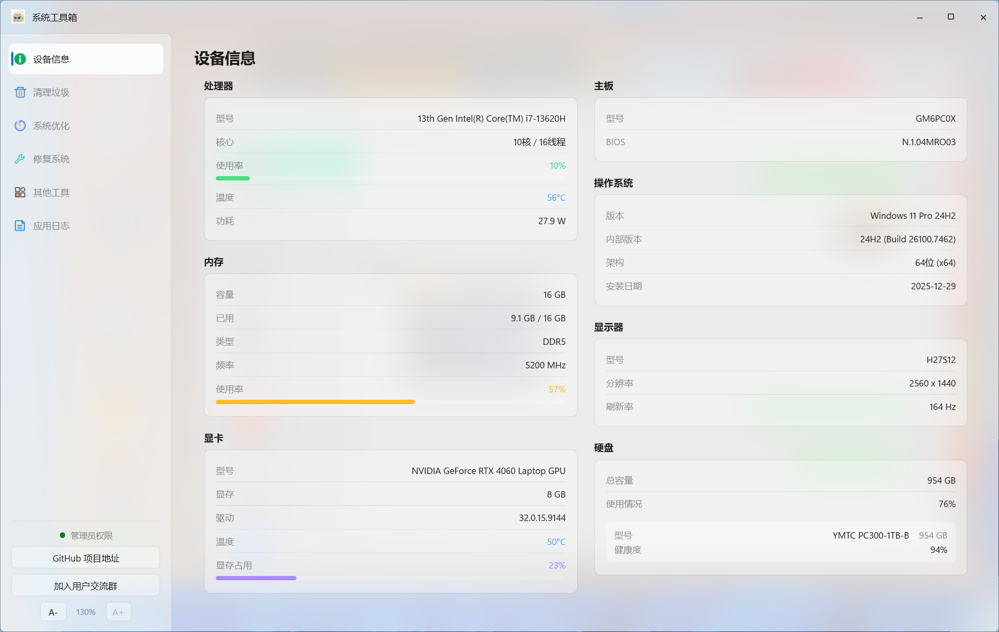
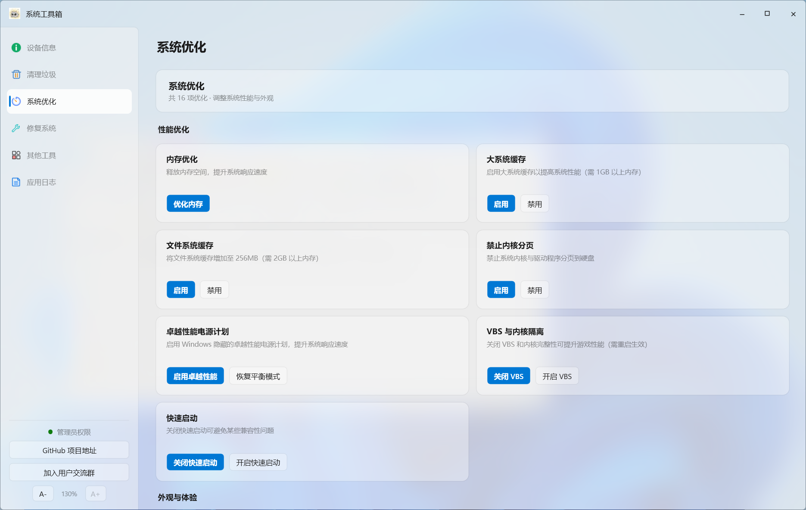

# 系统工具箱

Windows 桌面工具箱（WPF / .NET 10）：设备信息监控、系统垃圾清理、系统优化、系统修复、实用工具，一站式搞定日常维护。

## 界面预览

### 设备信息



### 清理垃圾


### 系统优化



## 功能介绍

- **设备信息**：CPU 型号 / 核心线程 / 使用率 / 温度 / 整包功耗，内存 / 显卡 / 主板 / 显示器 / 硬盘（型号、容量、健康度）实时监控
- **清理垃圾**：一键清理（系统缓存、浏览器、QQ、微信、音乐应用等，可自定义范围）+ 高级清理（16 项深度清理可单独勾选），清理前可预估可释放空间
- **系统优化**：内存优化、大系统缓存、卓越性能电源计划、VBS 与内核隔离开关、快速启动等 16 项优化
- **修复系统**：SFC / DISM 系统文件修复、网络修复（重置 Winsock / DNS / IP / 关闭代理）、桌面图标异常修复
- **其他工具**：内嵌 GEEK 卸载工具、Win11Debloat 精简脚本包
- **应用日志**：运行日志按级别筛选查看、导出，附带版本更新记录

界面跟随 Windows 深浅色主题自动切换，支持 Acrylic / Mica 毛玻璃效果与字体缩放。

## 运行要求

- Windows 10 / 11（x64）
- **需要管理员权限运行**（硬件监控与系统清理需要）
- 发布包为单文件（`系统工具箱.exe`），无需单独安装 .NET 运行时

## CPU 温度说明

CPU 温度通过 [LibreHardwareMonitor](https://github.com/LibreHardwareMonitor/LibreHardwareMonitor)
读取，它在 0.9.5+ 版本改用 **PawnIO** 内核驱动（已替代旧的 WinRing0）。

- PawnIO 驱动拥有正规数字签名（namazso.eu），**兼容 Windows 11 内存完整性（HVCI），无需关闭任何安全功能**
- 程序启动时若检测到驱动缺失，会弹窗询问；经你同意后自动完成安装（使用程序内置的官方安装包并校验哈希与签名，全程无需联网）
- 也可以手动安装：https://github.com/namazso/PawnIO.Setup/releases
- 不安装驱动不影响其他功能，只是 CPU 温度会显示为 `--`

## 第三方组件

| 组件 | 用途 | 说明 |
|------|------|------|
| PawnIO_setup.exe | CPU 温度读取驱动 | 官方原版内嵌，仅在用户同意后安装，见 `PawnIO_NOTICE.txt` |
| GEEK.exe | 软件卸载工具 | 内嵌资源，运行时解包到临时目录 |
| Win11Debloat.zip | Win11 精简脚本包 | 内嵌资源，运行时解包使用 |

## 从源码构建

```bash
dotnet build -c Release -p:EnableWindowsTargeting=true
```

发布单文件包（VS 中可用 `FolderProfile` 发布配置）：

```bash
dotnet publish -p:PublishProfile=FolderProfile -p:EnableWindowsTargeting=true
```

产物为 `系统工具箱.exe`。
